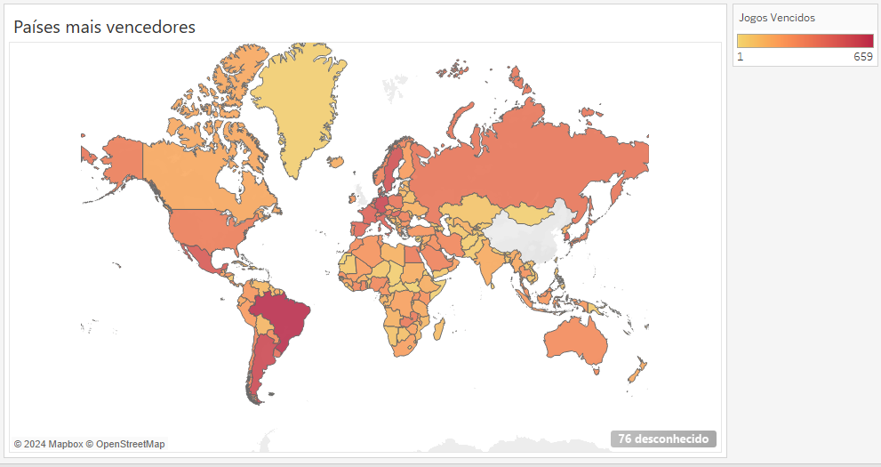

# ⚽ Resultados internacionais do futebol de 1872 a 2023

#### Fonte de dados
*[International football results from 1872 to 2023](https://www.kaggle.com/datasets/martj42/international-football-results-from-1872-to-2017) do Kaggle

##### Ferramentas utilizadas
* **Python** para tratamento, limpeza e visualização de dados
* **Tableau** para visualização de dados

### Perguntas
* Quais são os países mais vencedores?
* Houveram mudanças no futebol com o tempo?
* Quais são países mais vencedores?
* Quais são os maiores marcadores?
* Quais são os melhores cobradores de pênaltis?

[Notebook](futebol.ipynb)

#### País vencedores
   

